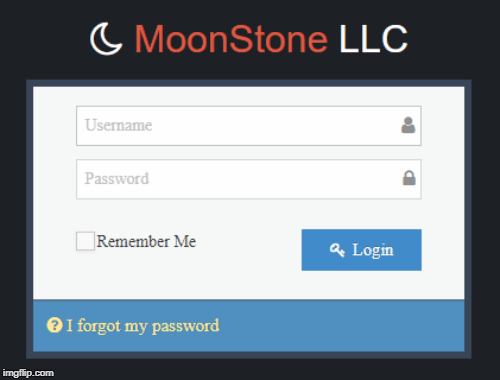

# barber-chain
> Barber chain application using MEN (Mongo, Express, Node) stack



## Quick Start

Add your MONGO_URI and user password to the d/server/config/config.json file. Make sure you set an env var for that on deployment

```bash
# Install dependencies for server
bower cache clean && bower install
npm app

# Run the server with concurrently
node --harmony app.js

# Server runs on http://localhost:3000
```

## Deployment

Simply push to Heroku and it will build

## App Info
This application is built for barber chains owners to allow them track sales report for each store after the assigned regular user inputs the sales after end of day. The sales report can be further utilize and build different charts for business analysis when implemented with [Chart.js](https://www.chartjs.org/)

> Current functions of application includes User management, Store management, New Daily Summary, Edit Daily Summary and Custom dates report, Export report to MS excel or PDF

### Demo of application [HERE](https://moonstonedev.herokuapp.com/)
```bash
Regular user:
username: test1   username: shelly
Password: test1   Password: shelly

Admin user:
username: admin
Password: admin
```

### Author

Harry Ho

### Version

0.0.2

### License

This project is licensed under the MIT License
